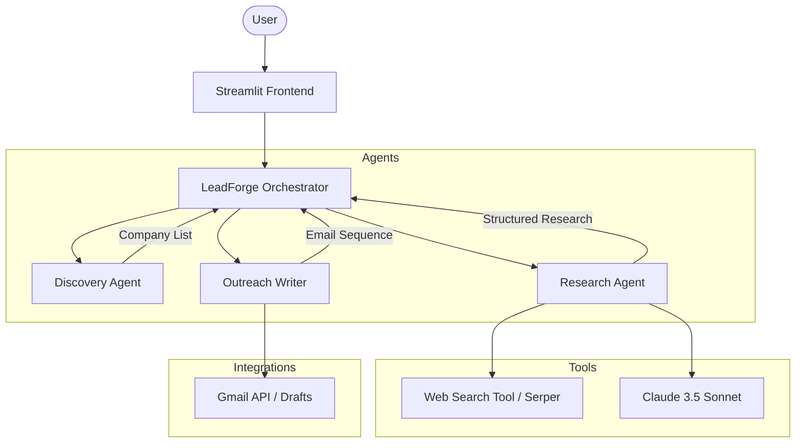
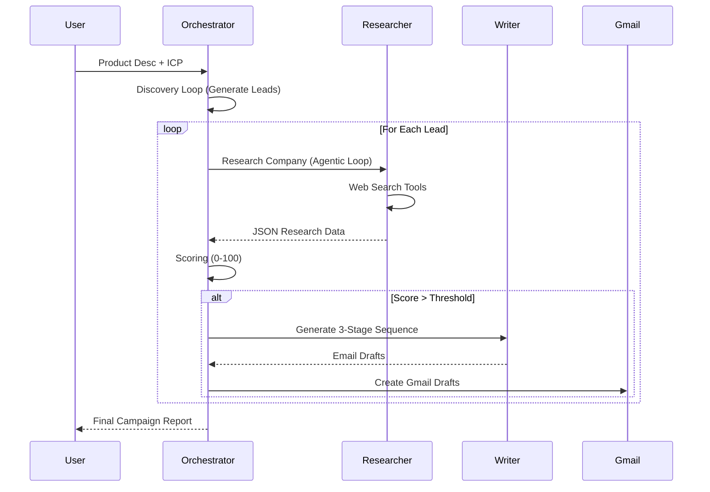

# ⚡ LeadForge: Autonomous B2B Lead Research & Outreach

<div align="center">


**The autonomous sales engineer that researches companies, qualifies leads, and drafts hyper-personalized outreach while you sleep.**

[Problem](#-the-problem) • [Solution](#-the-solution) • [Architecture](#-architecture) • [AI Deep Dive](#-ai-deep-dive) • [Installation](#-installation)

</div>

---

## 🛑 The Problem
Modern B2B sales is a manual grind. Sales Development Reps (SDRs) spend **65% of their time** on non-selling activities:
- **Blind Prospecting**: Searching for companies that *might* fit the Ideal Customer Profile (ICP).
- **Manual Research**: Spending 20-30 minutes per lead scanning news, websites, and LinkedIn.
- **Generic Outreach**: Sending "cookie-cutter" emails that get ignored because they lack relevance.
- **Tool Fatigue**: Jumping between Apollo, LinkedIn, Google Search, and Gmail.

## 🚀 The Solution: LeadForge
**LeadForge** is an end-to-end autonomous agent that transforms a simple product description into a list of high-intent, qualified leads with ready-to-send email drafts. It doesn't just find emails; it **understands** the business case for why your product fits a specific prospect.

- **Discovery**: Intelligent company brainstorming based on ICP.
- **Deep Research**: Agentic web searching for news, pain points, and tech stacks.
- **Dynamic Scoring**: AI-driven lead qualification (0-100).
- **Hyper-Personalization**: 3-stage email sequences tailored to recent company news.
- **Gmail Automation**: One-click draft creation in your inbox.

---

## ✨ Features
- 🧠 **Autonomous Orchestrator**: Manages complex state across discovery, research, and writing.
- 🔍 **Agentic Research**: Uses Claude 3.5 Sonnet with a recursive tool-use loop to search the web.
- 📊 **Intelligent Scoring**: Evaluates leads based on pain-point alignment and growth signals.
- ✉️ **Multi-Stage Outreach**: Generates a Day 1, Day 3, and Day 7 sequence for every lead.
- 📥 **Gmail Integration**: Syncs directly with Google Workspace to populate your drafts folder.
- 🛠️ **TokenRouter Ready**: Built-in support for discounted AI inference.

---

## 🗺️ User Journey
1. **Define**: Input your product description and define your target Industry, Company Size, and Title.
2. **Launch**: Click "Launch LeadForge" to wake up the agents.
3. **Observe**: Watch the live "Agent Activity" log as the researcher searches the web in real-time.
4. **Review**: Analyze qualified leads, their scores, and the generated outreach.
5. **Send**: Review the drafts automatically created in your Gmail and hit "Send".

---

## 🏗️ Architecture

LeadForge uses a **Hierarchical Agent Architecture** where a central Orchestrator delegates tasks to specialized agents.



---

## 🔄 Workflow

The sequential process that turns a prompt into a qualified lead.



---

## 💻 Tech Stack
- **Frontend**: [Streamlit](https://streamlit.io/) (Reactive Python UI)
- **AI Brain**: [Anthropic Claude 3.5 Sonnet](https://www.anthropic.com/claude)
- **Infrastructure**: [TokenRouter](https://paleblueai.com/) (API Gateway & Cost Optimization)
- **Search**: [Serper.dev](https://serper.dev/) (Google Search API)
- **Language**: Python 3.10+
- **Integrations**: Google Workspace (Gmail API)

---

## 🧠 AI Deep Dive: The Agentic Loop

### Recursive Tool Use
The **Research Agent** doesn't just perform one search. It operates in an "agentic loop":
1. **Plan**: Analyze the company name and ICP.
2. **Act**: Call the `web_search` tool with specific queries (e.g., "Company X recent funding", "Company X tech stack").
3. **Observe**: Read the search snippets.
4. **Refine**: If data is missing, search again with a different angle.
5. **Finalize**: Synthesize all findings into a structured JSON schema.

### Dynamic Lead Scoring
Instead of static rules, LeadForge uses **Semantic Scoring**. It presents the LLM with the research data and the product description, asking it to reason through the "Why" before assigning a number. This allows the system to identify subtle signals like "expanding to new markets" as a high-intent signal for a logistics product.

---

## 📈 Impact
- **Efficiency**: Reduces lead research time by **90%**.
- **Quality**: Leads are pre-qualified against your specific ICP.
- **Personalization**: Emails cite actual recent news, increasing reply rates by estimated **3-4x**.

---

## 🌍 Real-World Use Cases
- **SaaS Sales**: Find companies using a competitor's tech stack and pitch a migration.
- **Agencies**: Identify companies that just raised funding and need marketing/scaling help.
- **Recruitment**: Research companies that are growing rapidly to pitch talent services.

---

## ⚖️ Comparison

| Feature | Manual SDR | Apollo / Lusha | LeadForge |
| :--- | :--- | :--- | :--- |
| **Speed** | 30 mins/lead | 1 min/lead | 2 mins/lead (Fully Researched) |
| **Personalization** | High (but slow) | Low (Template) | **High (AI-Driven)** |
| **Context** | Human Research | Static Database | **Live Web Data** |
| **Outreach** | Manual | Automated (Static) | **Automated (Dynamic)** |

---

## 🚀 Scalability
LeadForge is built with a modular design. It can be scaled by:
- **Parallel Processing**: Running multiple research agents in parallel using Python threads/async.
- **Batch Processing**: Feeding CSVs of thousands of companies for overnight "Deep Research".
- **Multi-Model Support**: Using cheaper models (Claude Haiku) for discovery and premium models (Sonnet/Opus) for final writing.

---

## 🛡️ Security & Ethics
- **Data Privacy**: LeadForge does not scrape PII (Personally Identifiable Information) from social media. It relies on public corporate data.
- **Human-in-the-Loop**: By creating **Drafts** instead of sending emails automatically, we ensure a human reviews every message for tone and accuracy.
- **Compliance**: Respects `robots.txt` and search engine rate limits through official APIs.

---

## 📉 Trade-offs
- **Latency**: High-quality agentic research takes time (approx 30-60s per lead) compared to instant database lookups.
- **API Costs**: Running multi-turn Claude 3.5 loops is more expensive than basic templating.
- **Dependency**: Highly dependent on the quality of search engine results.

---

## ⚙️ Installation

### Quick Start (Windows)
1. **Clone the repo**:
   ```bash
   git clone https://github.com/youruser/leadforge.git
   cd leadforge
   ```
2. **Run Setup**:
   Simply run `setup.bat`. This will create a virtual environment, install dependencies, and generate your `.env` file.

### Manual Setup (MacOS/Linux)
1. **Setup Environment**:
   ```bash
   python -m venv venv
   source venv/bin/activate
   pip install -r requirements.txt
   ```

2. **Configure API Keys**:
   Create a `.env` file in the `leadforge/` directory (or use the provided `.env.example`):
   ```env
   ANTHROPIC_API_KEY=your_key
   SERPER_API_KEY=your_key
   ```

3. **Gmail API (Optional)**:
   - Go to [Google Cloud Console](https://console.cloud.google.com/).
   - Enable the Gmail API.
   - Download `credentials.json` and place it in the `leadforge/` folder.

4. **Run the App**:
   ```bash
   streamlit run app.py
   ```

---

## 🏆 Why This Will Win
Traditional lead gen tools are **static databases**. LeadForge is a **dynamic reasoning engine**. It doesn't just tell you *who* to email; it tells you *why* today is the perfect day to email them, and then it writes the email for you.

---

## 🔮 Future Scope
- **LinkedIn Automation**: Sending personalized connection requests.
- **CRM Sync**: Directly pushing qualified leads to Salesforce or Hubspot.
- **Voice Agent Integration**: Generating personalized scripts for cold calling.
- **Multimodal Research**: Analyzing company YouTube videos or podcasts for deeper insights.

---

## ❓ FAQ
**Q: Is the data live?**  
A: Yes, the agent performs real-time web searches for every lead.

**Q: Can I use it for any industry?**  
A: Absolutely. The LLM adapts its research strategy based on the industry you define.

**Q: How many leads can it process?**  
A: In the UI, it's set to 1-10 for speed, but the backend can handle bulk processing via scripts.

---

## 💡 Lessons Learned
- **Prompt Fragility**: LLMs need strict JSON schemas to prevent "conversational filler" from breaking the pipeline.
- **Tool Chaining**: Giving the agent a `web_search` tool is powerful, but it needs a "Max Turns" limit to prevent infinite loops.
- **Context Management**: Passing too much search data can confuse the writer; summarization is key.

---

<div align="center">
Built with ❤️ for the AI Agent Economy.
</div>
